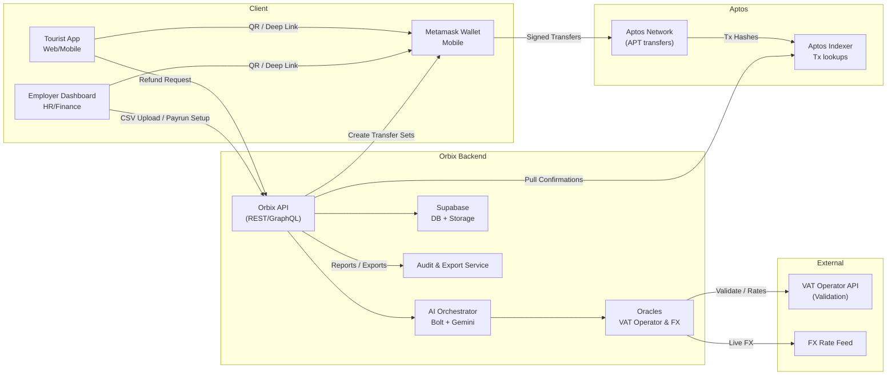
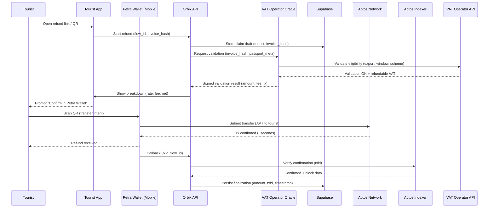
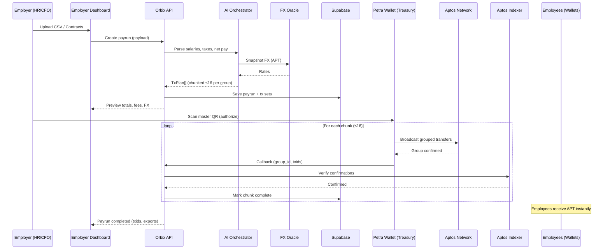
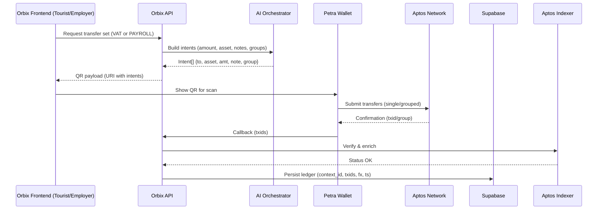

# 🌍 Orbix-Aptos

**Global Remittance Infrastructure for VAT Refunds & Payroll**  
Wallet-native. AI-powered. Borderless. Built on APTOS.

---

## 🚀 Overview

**Orbix-Aptos** is the **first on-chain VAT Refund & Payroll Payment Infrastructure** that operates without heavy smart contracts.  
Instead, it leverages:
- **Aptos blockchain's native transactions**
- **AI orchestration** for payroll computation and VAT eligibility
- **Supabase** for persistence, audit trails, and compliance exports

Two killer use cases, unified under one infrastructure:
1. **VAT Refunds** – Tourists scan QR at departure → confirm in Petra Wallet → refund instantly in APT.
2. **Payroll Automation** – Employers upload CSV → AI computes net salaries + FX → HR scans one QR → employees are paid in seconds.

---

## 🛑 Problem

- **Tourist VAT Refunds** are slow, manual, and often unclaimed due to airport delays.
- **Global Payroll** is plagued by high fees, delayed wires, hidden FX costs, and compliance overhead.
- Both processes rely on **centralized, fragmented rails** that fail in a borderless world.

---

## ✅ Solution

**Orbix-Aptos** provides a **wallet-native remittance infrastructure** where:
- Tourists **receive VAT refunds** instantly in stablecoins on Aptos.
- Employers **disburse payroll globally** with a single scan.
- Aptos blockchain ensures **finality in ~3s** and **ultra-low fees**.

---

## ⚙️ How It Works

### VAT Refund Flow
1. Retailer issues invoice + VAT claim tag.
2. Tourist opens Orbix-Aptos, uploads the invoice, flight ticket and VAT claim tag QR at any time, anywhere within 90 days.
3. AI validates eligibility with the Operator system.
4. Tourist confirms transfer in **Petra Wallet**.
5. Refund delivered instantly in **APT**.

### Payroll Flow
1. Employer uploads payroll CSV.
2. AI parses salaries, taxes, FX → generates `TxPlan[]`.
3. Dashboard displays preview → CFO/HR scans one QR.
4. Treasury wallet signs and sends **chunked atomic groups** (≤16 tx each).
5. Employees receive stablecoin salaries instantly on Aptos.

---

## 🔮 Features

- **Wallet-Native UX**: No contracts, no clunky DApps → just Petra Wallet scan + confirm.
- **Tourism-Grade Simplicity**: Refunds in 2 steps → Scan QR → Confirm transfer.
- **Enterprise Payroll**: AI-driven salary parsing, FX conversion, and bulk payouts.
- **Transparency**: Tx notes embed `claim_id` and `payrun_id` for deterministic audits.
- **Compliance Ready**: Supabase logs + JSON/CSV exports for regulators and finance teams.
- **Scalability**: Chunked atomic transfers for thousands of recipients.

---

## ⚡High-Level System Architecture

## ✅ VAT Refund – Airport Flow

## ✅ Payroll – CSV to Batched Payouts

## ✅ Shared Transfer Intent

## 🛠️ Tech Stack

- **Blockchain**: Aptos
  – Fast finality, ultra-low fees, and stablecoin rails (APT).

- **Wallet**: Petra Wallet
  – Mobile-first signing with QR scan/deep link support.

- **AI Layer**: [Bolt.new](https://bolt.new) + Gemini
  – Salary parsing, jurisdictional tax/FX reasoning, transfer instruction generation.

- **Backend**: [Supabase](https://supabase.com/)
  – Postgres DB, object storage, user audit logs, and compliance artifacts.

- **Frontend**: React + Next.js dashboards for tourists & employers.

- **Indexing**: Aptos Indexer for transaction verification & reporting.

---

## 📡 Data Flow

1. **Input**
   - VAT Refunds: Retailer receipts, passport/KYC snapshots.
   - Payroll: Employer CSV with gross pay data.

2. **Processing**
   - AI parses salaries, deductions, taxes.
   - AI validate VAT eligibility & fetches FX rates.

3. **Persistence**
   - Supabase stores invoices, payruns, logs, validation proofs.

4. **Execution**
   - API encodes transfer sets → generates QR codes → Petra Wallet signs & submits.

5. **Finality**
   - Aptos executes transfers.
   - Indexer confirms results.
   - Supabase logs for audit.

6. **Audit**
   - Export JSON/CSV/PDF reports for regulators & enterprise compliance.

---

## 🔐 Security & Compliance

- **Treasury Wallet**: Multisig or HSM-protected Petra Wallet for payroll disbursements.
- **Dual Approval**: CFO + HR authorization required for bulk payruns.
- **Oracle Verification**: Only signed operator callbacks can validate VAT claims.
- **KYC/AML Hooks**: Wallet screening APIs integrated during onboarding.
- **Immutable Audit Trail**: Supabase DB + Aptos tx hashes provide verifiable record-keeping.
- **Circuit Breakers**: Abort payruns if totals exceed configured treasury limits.

---

## 💰 Business Model

- **Platform Fees**: 0.5% per payout (tourist refund / payroll).
- **Enterprise SaaS**: Subscription-based dashboards & compliance exports for HR/finance teams.
- **Partnership Revenue**: Integration fees with VAT Operators & HR SaaS providers.
- **Future Yield**: Earn yield on idle treasury balances + capture micro-spreads on FX conversions.

---

## 📈 Go-To-Market (GTM)

- **Phase 1 – Tourism**:
  Pilot deployment at **Dubai International Airport** with VAT operator integration.

- **Phase 2 – Payroll**:
  Target **DAOs, Web3 startups, and SMEs** in Africa & LATAM with APT-based payroll rails on Aptos.

- **Phase 3 – Enterprise Expansion**:
  Partner with **multinationals** and expand VAT refunds to EU, UK, Singapore, and Saudi Arabia.

- **Phase 4 – DAO Governance**:
  Transition to community-driven governance of refund % rates, fee splits, and expansion markets.

---

## 🔮 Roadmap

- ✅ **MVP**: Wallet-native VAT refunds + CSV-based payroll automation.
- 🔄 **Next**: Multi-country VAT support + AI-driven tax compliance engine.
- 🔄 **Later**: Enterprise integrations, auto-scheduling, PDF-based compliance exports.
- 🌐 **Future**: Orbix-Aptos DAO + full protocol governance.

---

## 🌟 Why Aptos Blockchain?

Orbix-Aptos leverages the unique advantages of the Aptos blockchain:

- **Lightning-Fast Finality**: ~3 second transaction finality enables real-time VAT refunds and instant payroll.
- **Minimal Transaction Fees**: Fraction-of-a-cent transaction costs make micro-refunds economically viable.
- **Atomic Transfers**: Native support for grouped transactions enables efficient bulk payroll disbursements.
- **Scalability**: High throughput capacity supports enterprise-grade payment volumes.
- **Developer-Friendly**: Aptos's intuitive transaction model simplifies integration without complex smart contracts.
- **Energy Efficiency**: Environmentally sustainable consensus mechanism aligns with corporate ESG goals.
- **Robust Indexing**: Advanced indexing capabilities enable real-time payment tracking and compliance reporting.
