# Orbix


## Prototype

• Landing page
  
   

• Landing page explaining features
  
   

• After clicking wallet, Petra asks for confirmation to connect
  
   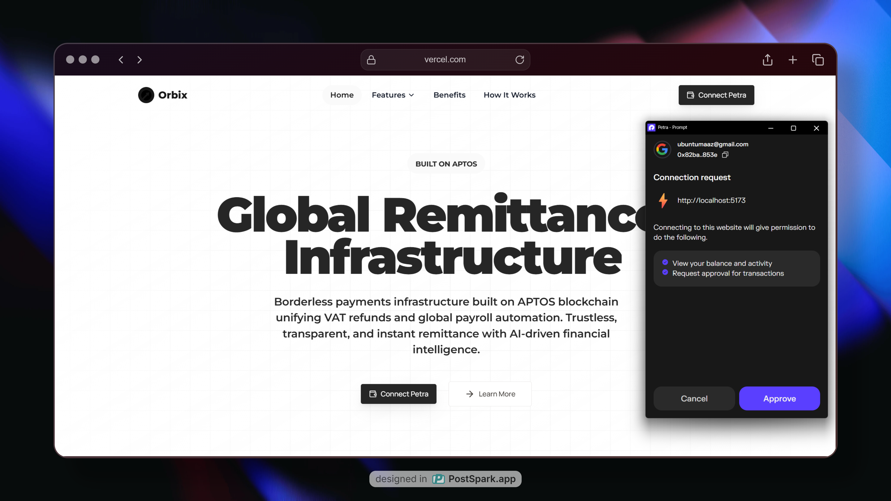

• Dashboard
  
   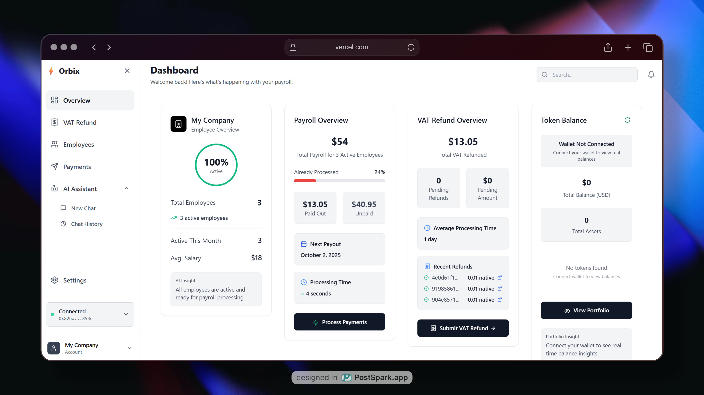

• VAT refund
  
   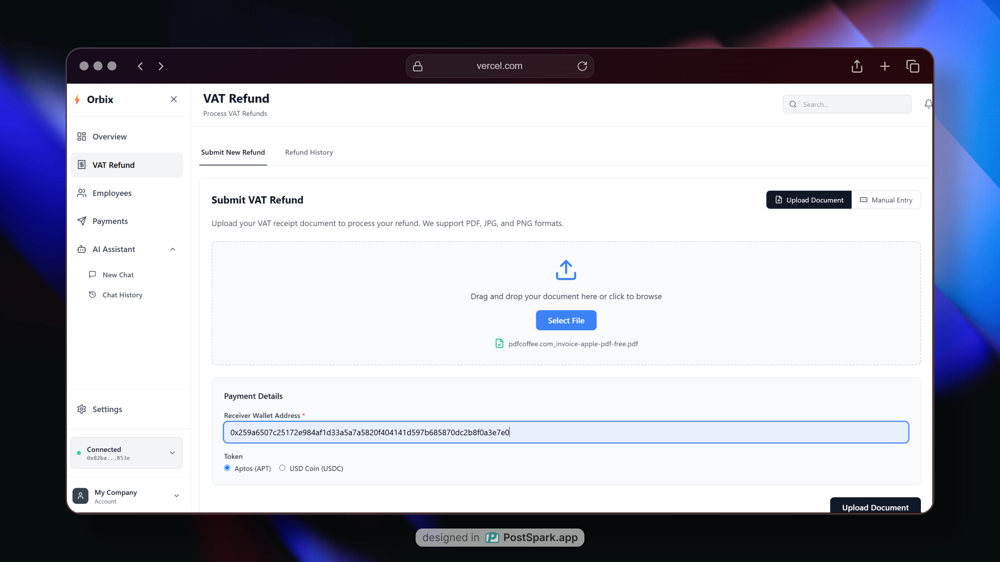

• VAT refund approval
  
   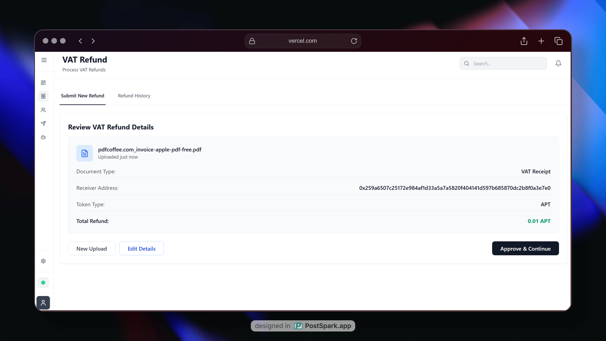

• Petra asking to confirm the transaction
  
   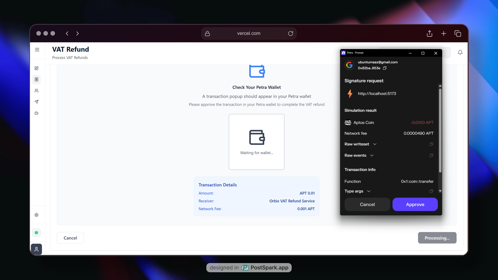

• Transaction hash on Aptos Explorer
  
   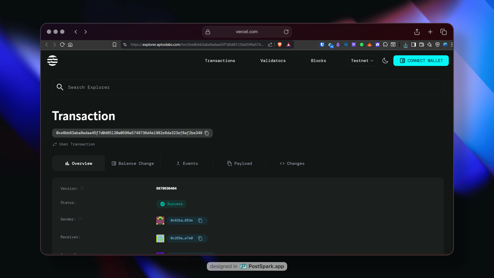

• VAT refund history
  
   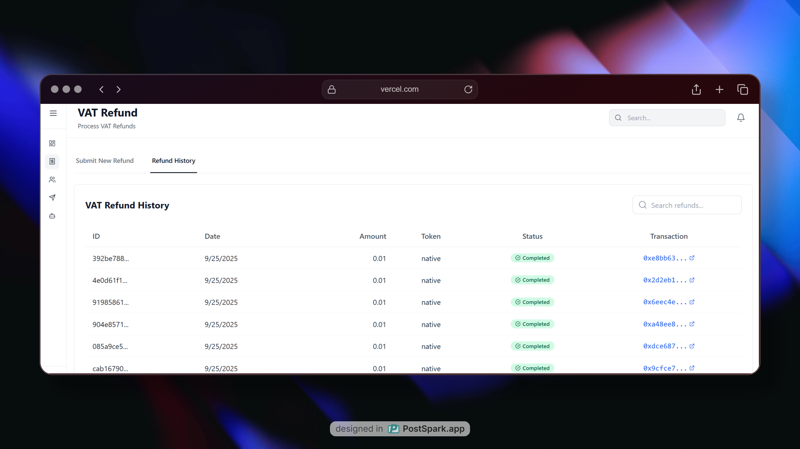

• Employee management
  
   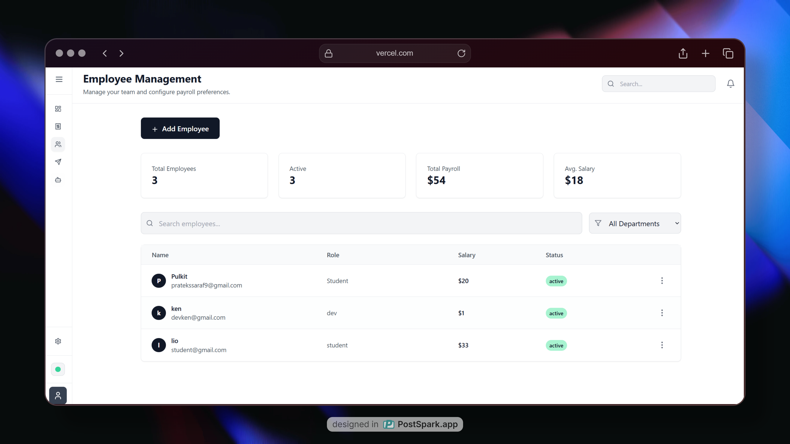

• Add employee either manually or via bulk CSV
  
   


• Bulk transfer
  
   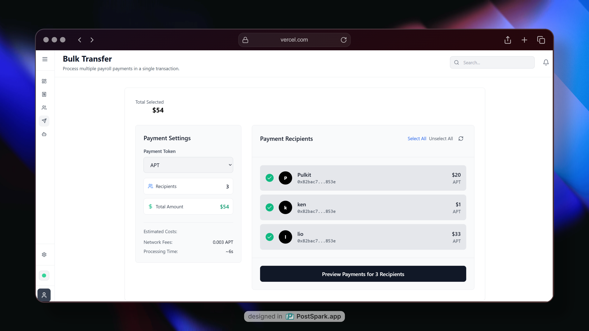

• AI assistant
  
   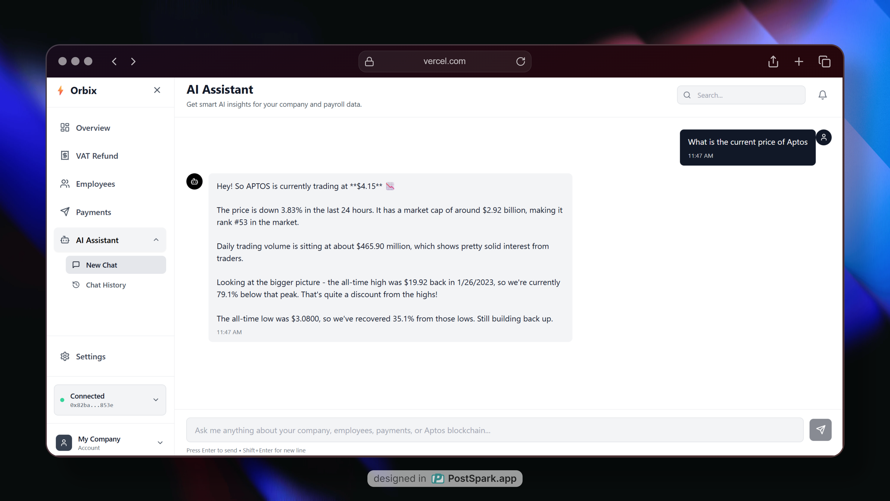


**On-chain VAT Refund Payment Protocol Infrastructure** protecting users against time loss, missed claims in fear of missing flights, and payment failures, powered by Aptos.

**Simply means "Helping users to claim VAT Refund Anytime Anywhere without hassling"**

---

## 💡 Story / Inspiration

**The Problem That Started It All:**
- Travelled to Dubai, bought MAC and BALMAIN clothes worth 1000 AED VAT claim
- Reached DXB airport cutting it close due to Dubai Burj Khalifa traffic  
- Saw a long queue at VAT refund counter, decided to wait - line wasn't moving
- **Result: Missed flight, lost 5000 AED flight ticket = Net Loss 6000 Dirhams**

This isn't just my problem - **it's a global crisis.**

### 📊 The Global Problem
**$200 Billion in VAT Goes Unclaimed Annually** due to:
- Long queues at VAT refund counters (Dubai, Planet, etc.)
- Fear of missing flights
- Forgotten claims or lost receipts  
- Average refund processing time: **10+ days**
- Complex paperwork and bureaucratic delays

These delays cause inconvenience, financial losses, and system failures worldwide.

---

## 🚀 The Solution: ⚡ Orbix

**Helping Masses to:**
- ✅ Claim VAT Refund fully on-chain **anytime, anywhere**
- ✅ **Super Simple, Super Efficient, Super Easy** process
- ✅ **Non-Intrusive**: No additional parameters, code, or complex application processes
- ✅ **Simple Configuration** with maximum impact

**Orbix** is a comprehensive **VAT Refund & Payroll Payment Infrastructure** built on the Aptos blockchain that eliminates traditional pain points through:
- **Aptos blockchain** with Move smart contracts for secure, instant transactions
- **Petra Wallet integration** for seamless user experience  
- **AI orchestration** (Google Gemini) for automated processing and validation
- **Supabase** for robust backend services and audit trails

---

## 🛑 Problem

- **Tourist VAT Refunds** are slow, manual, and often unclaimed due to airport delays.
- **Global Payroll** is plagued by high fees, delayed wires, hidden FX costs, and compliance overhead.
- Both processes rely on **centralized, fragmented rails** that fail in a borderless world.

---

## ✅ Solution

**Orbix** provides a **wallet-native payment infrastructure** where:
- Tourists **receive VAT refunds** instantly through Petra Wallet integration.
- Employers **manage payroll globally** with AI-assisted calculations and bulk transfers.
- Aptos blockchain ensures **fast finality (~3s)** and **low transaction costs**.
- Smart contracts handle payment processing and audit trails automatically.

---

## ⚡ How It Works?

### 1. **Tourist VAT Refund Flow:**
- Retailer issues digital invoice + tax-free tag → Orbix locks a claim box on Aptos
- Tourist departs → claim status flips to **VALIDATED**
- Protocol computes: `refund = VAT × rate – fee` (configurable: 85–87%)
- Executes instant payout in **APT** through Petra Wallet

### 2. **Payroll Flow:**  
- HR uploads payroll CSV → AI parses and applies jurisdiction-specific tax rules
- System snapshots FX rates and creates pay run ID anchored on-chain
- Funds disbursed through **chunked atomic transfers** (≤16 tx/group)
- Employees receive payments **instantly** with immutable audit trails

**Both modules share unified protocol treasury and compliance guardrails.**

---

## ⚡ Features

### **For Tourists (VAT Refunds)**
- 🚀 **Instant Refunds**: Add info → Scan QR → Confirm in Petra Wallet → Receive APT instantly
- ✈️ **No Missed Claims**: Avoid kiosk queues and paperwork bottlenecks entirely
- 💎 **Transparent Deductions**: Refund percentage and fees displayed in-wallet before confirmation  
- 🌍 **Cross-Border Utility**: Funds usable worldwide, not tied to local banking rails

### **For Employers (Payroll)**
- ⚡ **Bulk Payroll in Seconds**: Upload CSV → AI computes → One QR scan → Multiple employees paid
- 💰 **Low Fees, Instant Finality**: Aptos transfers confirm in ~4s with negligible costs
- 🤖 **AI Compliance Layer**: Jurisdiction-aware salary parsing, deductions, and FX conversions

### **Unified Benefits**
- 📱 **Wallet-Native UX**: All approvals via Petra Wallet (scan + confirm)
- 📋 **Auditability**: Each refund/payrun anchored with metadata (`claim_id`, `payrun_id`)
- 🌐 **Global Reach**: Single infrastructure serving both tourists and enterprises

---

## ⚡System Architecture

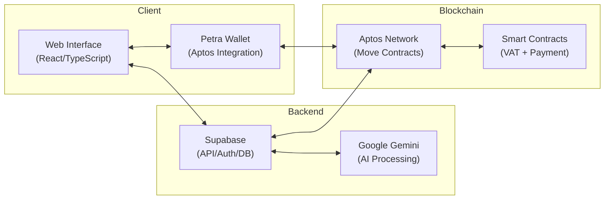

## ✅ VAT Refund Flow

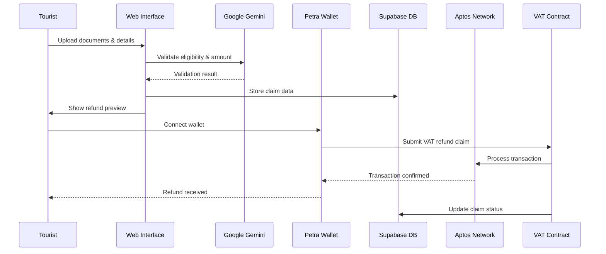

## ✅ Payroll Processing Flow

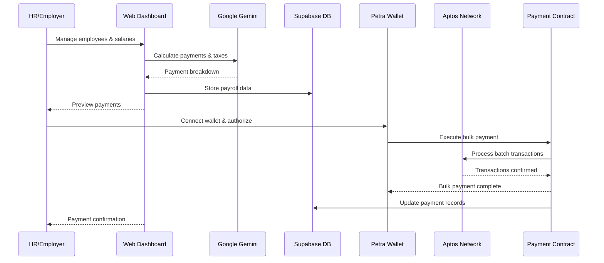

## 🚀 Getting Started

### Prerequisites
- Node.js (v18 or higher)
- PNPM package manager
- Petra Wallet browser extension
- Supabase account
- Google AI API key

### Installation

1. **Clone the repository**
   ```bash
   git clone https://github.com/somewherelostt/Orbix.git
   cd Orbix
   ```

2. **Install dependencies**
   ```bash
   pnpm install
   ```

3. **Environment Setup**
   Create a `.env` file in the root directory:
   ```env
   VITE_SUPABASE_URL=your_supabase_url
   VITE_SUPABASE_ANON_KEY=your_supabase_anon_key
   VITE_GEMINI_API_KEY=your_google_ai_api_key
   ```

4. **Start the development server**
   ```bash
   pnpm dev
   ```

5. **Deploy Smart Contracts**
   ```bash
   cd contracts
   aptos move compile
   aptos move publish
   ```

### Usage

1. **Connect Petra Wallet** through the web interface
2. **For VAT Refunds**: Upload receipts and documentation
3. **For Payroll**: Add employees and configure payments
4. **Monitor transactions** through the dashboard

## 📁 Project Structure

```
src/
├── components/          # React components
├── hooks/              # Custom React hooks
├── services/           # External service integrations
├── utils/              # Utility functions and Aptos helpers
├── contexts/           # React context providers
├── ui/                 # UI component library
└── lib/                # Library configurations

contracts/
├── sources/            # Move smart contracts
└── Move.toml          # Contract configuration
```

## ⚡ Tech Stack

### 1. **Aptos Native Transfers**
- Direct payment transactions with Move smart contracts
- **Atomic groups** (≤16 transfers at once) for efficient batching
- Payout notes include metadata: `claim_id` or `payrun_id` for auditability

### 2. **Petra Wallet Integration**
- Core interaction layer for tourists, employers, and employees
- **Deep linking & QR scanning** for seamless UX
- In-app transfer confirmation with transparent fee display

### 3. **AI Layer (Google Gemini)**
- **Payroll**: Salary parsing, FX rate lookup, OCR processing
- **VAT**: Validation checks and eligibility verification  
- Outputs human-readable & blockchain-ready transfer instructions

### 4. **Supabase Backend**
- Stores receipts, payruns, validation logs, and AI outputs
- Transfer hash storage for regulatory compliance
- Real-time database with authentication and authorization

---

## 📡 Data Flow

1. **User Input**
   - VAT Refunds: Document uploads, receipt images, eligibility information
   - Payroll: Employee management, salary data, payment configurations

2. **AI Processing**  
   - Google Gemini validates documents and calculates eligible amounts
   - Automated tax calculations and compliance checks

3. **Database Operations**
   - Supabase stores user profiles, payment history, and transaction logs
   - Real-time updates for dashboard synchronization

4. **Blockchain Execution**
   - Petra Wallet handles user authentication and transaction signing
   - Move smart contracts process payments and maintain audit trails
   - Aptos network provides fast finality and low transaction costs

5. **Audit & Reporting**
   - Transaction hashes stored for immutable proof
   - Dashboard provides real-time payment tracking and history

---

## 🔐 Security & Compliance

- **Petra Wallet Integration**: Secure key management through Aptos ecosystem
- **Smart Contract Security**: Move language provides memory safety and resource protection
- **Supabase Auth**: Row-level security and JWT-based authentication
- **AI Processing**: Document validation without storing sensitive personal data
- **Audit Trail**: Immutable transaction records on Aptos blockchain
- **Input Validation**: Comprehensive address and amount validation before processing

---

## 💰 Business Model

### **Transaction Fees**
- Taking a **0.5% platform fee** on each refund/payroll payout

### **Enterprise Subscriptions**  
- Employers pay monthly SaaS fees for:
  - Advanced payroll dashboard and analytics
  - Compliance tools and automated reporting
  - Audit exports and regulatory documentation

### **Partnership Revenue**
- **VAT Operator Integration**: Revenue-sharing with Dubai VAT Refund Authorities, Planet, FTA
- **API Licensing**: Package deals for fintechs/DAOs wanting to use Orbix infrastructure

### **Treasury Float & FX Spread** *(Future)*
- Earn yield on treasury idle balances
- Capture micro-spreads on in-app FX conversions

---

## ⚡ Go-To-Market Strategy

### **Phase 1: Tourism (Dubai)**
- Partner with **approved VAT Operators** in UAE
- Deploy at **Dubai International Airport** as "fast-track refunds via Petra Wallet"
- Onboard tourists via signage, airline check-in, and in-airport promotions
- *Why Dubai?* Comparatively easy country to start with and has existing agreements with Aptos

### **Phase 2: Payroll (Web3 + Startups)**
- Target **remote-first startups, DAOs, and SMEs** in India, Africa, LATAM, and Asia
- Offer **APT payroll rails** for distributed global teams
- Collaborate with accelerators and Web3 communities for rapid adoption

### **Phase 3: Enterprise Expansion**
- Partner with **multinationals** for cross-border salary disbursement
- Offer **API + compliance dashboards** for HR SaaS integrations  
- Add more VAT geographies: **EU, UK, Singapore, Saudi Arabia**

### **Phase 4: Orbix DAO & Network Effects**
- Transition governance to a **decentralized DAO**
- Community votes on fee splits, refund % rates, and expansion markets
- **Tokenize access**: Loyalty incentives for employers and tourists using Orbix infrastructure

---

## ⚡ Future Vision

### **Multi-Country Expansion**
- Add **EU, UK, and Asia** VAT refund partners for global coverage

### **Payroll AI++**  
- **Jurisdiction-specific payroll tax modules** → auto-deduct & calculate net pay
- **Treasury Automation**: Auto-scheduling payroll runs based on company preferences

### **Enterprise APIs**
- Enable **fintechs, DAOs, and global SMBs** to plug Orbix rails into their HR/payments stack
- White-label solutions for existing payment processors

### **Compliance Integrations**
- **Automated KYC hooks** and AML screening for regulatory compliance
- **PDF audit reports** for enterprises and regulators
- Real-time compliance monitoring and alerting

### **DAO Governance** 
- **Refund % fees, payroll fee splits, and expansion markets** managed by Orbix DAO
- Community-driven product roadmap and feature prioritization

---

## 🎯 Why Orbix Will Succeed

- ✅ **Real Problem**: $200B+ VAT goes unclaimed annually - massive market opportunity
- ✅ **Proven Solution**: Started with founder's personal pain point in Dubai
- ✅ **Strategic Location**: Dubai as launch market with Aptos partnerships  
- ✅ **Technical Excellence**: Built on fast, low-cost Aptos infrastructure
- ✅ **User Experience**: Wallet-native flows eliminate friction completely

**⚡ Orbix will be killing it!!**

---

## 🌟 Why Aptos Blockchain?

Orbix leverages the unique advantages of the Aptos blockchain:

- **Lightning-Fast Finality**: ~3 second transaction finality enables real-time payments
- **Low Transaction Costs**: Minimal fees make micro-transactions economically viable
- **Move Smart Contracts**: Memory-safe, resource-oriented programming for secure DeFi
- **Parallel Execution**: High throughput supports enterprise-scale payment volumes
- **Petra Wallet Ecosystem**: Seamless integration with Aptos's premier wallet
- **Developer Experience**: Intuitive APIs and comprehensive TypeScript SDK
- **Sustainable Consensus**: Energy-efficient proof-of-stake mechanism

## 🤝 Contributing

We welcome contributions to Orbix! Please follow these steps:

1. Fork the repository
2. Create a feature branch (`git checkout -b feature/amazing-feature`)
3. Commit your changes (`git commit -m 'Add amazing feature'`)
4. Push to the branch (`git push origin feature/amazing-feature`)
5. Open a Pull Request

## 📄 License

This project is licensed under the MIT License - see the [LICENSE](LICENSE) file for details.

## 📞 Contact

- **GitHub**: [Maaz](https://github.com/somewherelostt), [Swyam](https://github.com/areycruzer),[Pulkit](https://github.com/pulkit7070)
- **Repository**: [Orbix](https://github.com/somewherelostt/Orbix)

---

Built with ❤️ for the future of global payments
